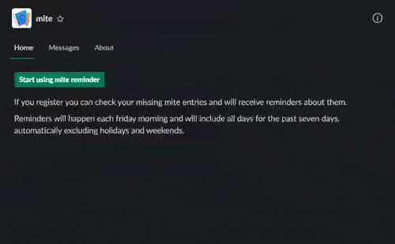

[](https://github.com/leanovate/mite-reminder/actions?query=workflow%3A%22Node.js+CI%22)

# mite-reminder
This is a slack app for reminding mite users about missing time entries.

[](demo.gif)

## How to run
You will need to set up a few environment variables. Either `export <VAR_NAME>=<VAR_VALUE>` them or put them in a `.env` [file](https://github.com/motdotla/dotenv#readme).

You will need:
* `SLACK_TOKEN` and `SLACK_SIGNING_SECRET`. You can get these when you setup a new app in slack.
* `MITE_ACCOUNT_NAME`. This is the prefix of your mite url in `https://<MITE_ACCOUNT_NAME>.mite.yo.lk`
* (optionally) `MITE_API_KEY`. Adding a mite api key with admin rights allows the user to check for times without having to provide its own api key.

Then, run the app with:
```
npm i
npm start
```

The bot will need some scopes to work properly, which you will need to setup in the slack app settings at `OAuth & Permissions` -> `Scopes` -> `Bot Token Scopes`:

* chat:write (for sending messages to users)
* im:write (for sending messages to users)
* im:history (for reading direct messages from users)
* im:read (for reading direct messages from users)
* users:read (for checking times for all users of a channel)
* users:read.email (for automatic matching between slack and mite acocunts)
